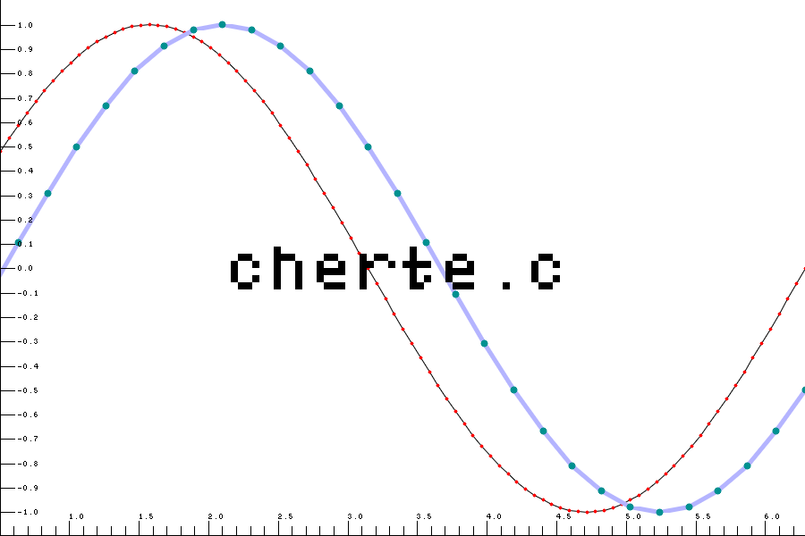

# Cherte.c

<p align="center">

</p>

> [!WARNING]
> THIS LIBRARY IS A WORK IN PROGRESS (AND ALSO MAY BE ABANDONED ANYTIME)! ANYTHING CAN CHANGE AT ANY MOMENT WITHOUT ANY NOTICE! USE THIS LIBRARY AT YOUR OWN RISK!
> Also the tick setting functionality is poorly tested and ticks and tick labels may be put in the wrong place.
> Also the alpha stuff is not yet perfected.
> btw TODO: write agenda on what needs to be improved (this is partly addressed by TODOs in the comments)

A small addition to [Olive.c](https://github.com/tsoding/olive.c) for plotting data.

Library name is pronounced as *tchertets* or *чертец* or [t͡ʃʲirtʲˈet͡s] in Russian. 

# Supported plots

Currently only scatterplots are supported. Points may be optionally connected by straight lines. No Bezier curves or spline functionality (yet).

# Usage

See [example_plot.c](./example_plot.c) for usage example. This example uses [olive.c](https://github.com/tsoding/olive.c/blob/master/olive.c) and [stb_image_write.h](https://raw.githubusercontent.com/nothings/stb/master/stb_image_write.h) header files.

To build example, type

```bash
make example_plot
```

The Makefile will download all the needed dependencies using wget. If you are concerned about automatically downloading stuff, check the [Makefile](./Makefile) and do the stuff manually.

# Name origin

Library's name is a pun on Russian verb "чертить" (to draw [a schematic or a technical drawing]) and dialect Ukrainian "чертец", which is a kind of dormouse (big hazel dormouse or a garden dormouse idk sources differ).
- [Vasmer's dictionary page with the definiton of chertec (чертец) as große Haselmaus, i.e. big hazel mouse](https://archive.org/download/Vasm0561/Vasm0905%20%D1%87%D0%B5%D1%81%D0%B0%D1%82%D1%8C.TIF).
- [Vasmer's dictionary page with the definiton of chertec (чертец) as Муохus nitela](https://starlingdb.org/cgi-bin/response.cgi?root=morpho&basename=morpho%2fvasmer%2fvasmer&first=16444). Myoxus nitela is [Eliomys quercinus (Linnaeus, 1766)](https://www.gbif.org/species/8307820) (garden dormouse).

# License

MIT

